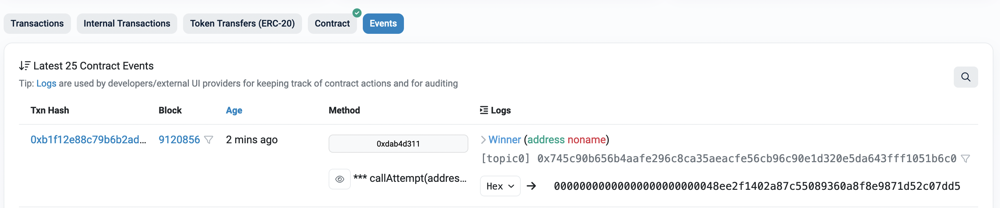

# 🏁 Your Goal: Emit the Winner event

Success! 🎉


---

Your goal is simple! Emit the winner event on this smart contract on the Goerli testnet: https://goerli.etherscan.io/address/0xcF469d3BEB3Fc24cEe979eFf83BE33ed50988502#code

If you take a look at the Code tab in Etherscan, you'll see that the source code for this contract looks like this:

```solidity
// SPDX-License-Identifier: Unlicense
pragma solidity ^0.8.0;

contract Contract {
event Winner(address);

    function attempt() external {
        require(msg.sender != tx.origin, "msg.sender is equal to tx.origin");
        emit Winner(msg.sender);
    }

}
```

How do we possibly make it so the `tx.origin` (the EOA who originated the transaction) is not equal to the `msg.sender`? 🤔

We'll leave that challenge up to you!

## The Leaderboard

Once you've completed the challenge you should find your address amongst the list of winners [on the events tab](https://goerli.etherscan.io/address/0xcF469d3BEB3Fc24cEe979eFf83BE33ed50988502#events). Check out how many other people have completed this challenge!
